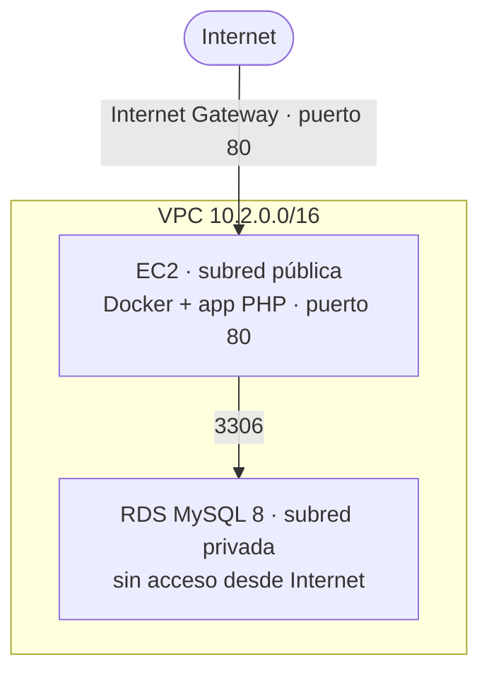

# aws-infraestructure-version-2-

[](https://github.com/albert0fernandez/aws-infraestructure-version-2-/actions/workflows/terraform.yml)
[](https://github.com/albert0fernandez/aws-infraestructure-version-2-/actions/workflows/docker.yml)

**Integración de Docker · Terraform · CI/CD con GitHub Actions.**

Despliegue completo de una aplicación de inventario (PHP + MySQL) sobre AWS: primero
empaquetada en contenedores, luego levantada en la nube como *Infraestructura como
Código* con Terraform, y finalmente automatizada con integración continua.

## Roadmap

- [x] **Fase 1** — Aplicación PHP dockerizada (Docker Compose: app + MySQL)
- [x] **Fase 2** — Infraestructura en AWS con Terraform (VPC, RDS, EC2 + Docker)
- [x] **Fase 3** — CI/CD con GitHub Actions (validación de Terraform + build/push de la imagen a GHCR)
- [x] **Fase 4** — Documentación (este README)

## Índice

1. [Introducción](#1-introducción)
2. [CloudFormation vs Terraform](#2-cloudformation-vs-terraform)
3. [Arquitectura](#3-arquitectura)
4. [Estructura del repositorio](#4-estructura-del-repositorio)
5. [Cómo ejecutarlo en local (Docker)](#5-cómo-ejecutarlo-en-local-docker)
6. [Cómo desplegarlo en AWS (Terraform)](#6-cómo-desplegarlo-en-aws-terraform)
7. [CI/CD con GitHub Actions](#7-cicd-con-github-actions)
8. [Capturas](#8-capturas)
9. [Seguridad](#9-seguridad)
10. [Lecciones aprendidas y mejoras futuras](#10-lecciones-aprendidas-y-mejoras-futuras)

---

## 1. Introducción

Este proyecto es la **versión 2** de un despliegue de la misma aplicación de inventario.
Lo que evoluciona no es la app, sino *cómo* se construye la infraestructura que la sostiene:

- **v1** — la infraestructura de AWS (VPC, subredes, EC2, RDS) se definía con
  **CloudFormation** (plantilla YAML nativa de AWS).
- **v2 (este repo)** — la misma arquitectura, descrita con **Terraform**, más los
  contenedores Docker de la aplicación y una capa de CI/CD con GitHub Actions.

> 📎 **Repositorio de la v1 (CloudFormation):** [aws-cloud-infrastructure-project](https://github.com/albert0fernandez/aws-cloud-infrastructure-project)

---

## 2. CloudFormation vs Terraform

El salto de la v1 a la v2 es pasar de CloudFormation a Terraform. Esta tabla resume por
qué y qué aporta cada herramienta:

| Aspecto | CloudFormation (v1) | Terraform (v2) |
|---|---|---|
| **Lenguaje** | YAML/JSON, específico de AWS | HCL, más legible y expresivo |
| **Alcance** | Solo AWS | Multi-proveedor (AWS, Azure, GCP…) |
| **Estado** | Lo gestiona AWS internamente (*stacks*), no ves el fichero | Fichero `terraform.tfstate` que gestionas tú (local o remoto) |
| **Previsualización** | *Change sets* (existe, pero es un paso aparte) | `terraform plan` nativo: ves los cambios **antes** de aplicar |
| **Reutilización** | *Nested stacks*, algo rígidas | **Módulos** de primera clase (`network`, `compute`, `database`) |
| **Comunidad** | Recursos y ejemplos de AWS | *Registry* con miles de módulos y *providers* |

**Qué se aprende con cada uno:**
- **CloudFormation** enseña el modelo de recursos de AWS "puro", sin capas intermedias.
- **Terraform** aporta un flujo más seguro (`plan` antes de `apply`), un estado explícito
  que hay que entender y proteger, y una modularidad que hace el código reutilizable.

---

## 3. Arquitectura

Una **VPC** con dos capas: la **EC2** (pública, con la app en Docker) es la única que
puede hablar con la **RDS** (privada, sin salida a Internet).




**Firewall (security groups):** puerto **80** abierto a todos, **22 (SSH)** solo desde tu
IP, y **3306 (MySQL)** solo desde la capa web. Se despliega en **2 zonas de
disponibilidad** para tener subredes redundantes.

---

## 4. Estructura del repositorio

```
.
├── docker/                     # Fase 1 — app dockerizada
│   ├── app/                    #   Dockerfile + código PHP de la app
│   ├── db/init.sql             #   esquema y datos iniciales de MySQL
│   └── docker-compose.yml      #   app + MySQL para levantar en local
├── terraform/                  # Fase 2 — Infraestructura como Código
│   ├── main.tf                 #   orquesta los 3 módulos
│   ├── providers.tf            #   proveedor AWS, región, versión
│   ├── variables.tf / outputs.tf
│   ├── terraform.tfvars.example#   plantilla de variables (sin secretos)
│   └── modules/
│       ├── network/            #   VPC, subredes, IGW, security groups
│       ├── compute/            #   EC2 + user_data (Docker)
│       └── database/           #   RDS MySQL privada
└── .github/workflows/          # Fase 3 — CI/CD
    ├── terraform.yml           #   Terraform CI (fmt, init, validate)
    └── docker.yml              #   Docker Build (build + push a GHCR)
```

---

## 5. Cómo ejecutarlo en local (Docker)

Reproduce en tu máquina el par EC2 + RDS con dos contenedores: la app PHP y MySQL 8. La
base de datos **no expone puertos** (como una RDS privada) y la app espera a su
*healthcheck* antes de arrancar.

```bash
cd docker
cp .env.example .env      # ajusta credenciales si quieres
docker compose up -d --build
```

La app queda en `http://localhost` y la base se carga automáticamente desde
`db/init.sql`.


---

## 6. Cómo desplegarlo en AWS (Terraform)

### Módulos

| Módulo | Qué crea |
| :--- | :--- |
| **`network`** | VPC (`10.2.0.0/16`), subredes públicas/privadas (2 AZ), Internet Gateway, rutas y *security groups*. |
| **`compute`** | EC2 Ubuntu (`t3.micro`) + `user_data.sh.tpl`, que instala Docker, clona el repo y levanta el contenedor apuntando a la RDS. |
| **`database`** | RDS MySQL 8 (`db.t3.micro`) privada, en las subredes privadas. |

### Variables necesarias

Crea `terraform/terraform.tfvars` a partir de `terraform.tfvars.example`. Las dos
obligatorias no tienen valor por defecto:

| Variable | Obligatoria | Descripción |
|---|---|---|
| `admin_cidr` | ✅ | Tu IP pública en CIDR (ej. `1.2.3.4/32`) para el acceso SSH |
| `db_password` | ✅ | Contraseña maestra de la RDS (nunca se sube al repo) |
| `aws_region` | — | Por defecto `eu-west-1` |
| `project_name` | — | Por defecto `retacantabria-v2` |
| `instance_type` / `db_name` / `db_user` | — | Valores por defecto elegibles Free Tier |

### Despliegue

```bash
export AWS_PROFILE=admin       # usa el usuario IAM, no root
cd terraform
terraform init                 # descarga el proveedor de AWS (solo la 1ª vez)
terraform plan                 # muestra qué se va a crear, sin tocar nada
terraform apply                # crea la infraestructura REAL (~5-10 min por la RDS)
```

Al terminar, Terraform muestra los **outputs** (IP pública de la EC2 y endpoint de la
RDS). Dale ~3-4 min extra a que el `user_data` arranque la app.

Acceso a la app: `Administrador` / `MiClave@2026`.

### Destroy — decisión FinOps

Como AWS **cobra por hora**, la plataforma se levanta **bajo demanda** y se destruye al
terminar:

```bash
export AWS_PROFILE=admin
cd terraform
terraform destroy              # borra EC2, RDS, VPC y todo lo creado
```

Con la infraestructura destruida el **coste es ~0 €**: el código Terraform queda en el
repo y se puede volver a levantar todo idéntico en minutos.

```
Código .tf  →  apply  →  Infra REAL en AWS  →  verificar  →  destroy
(describes)    (crea)     (existe y cobra)      (capturas)    (borra todo)
```

---

## 7. CI/CD con GitHub Actions

Cada cambio en el repo se valida y se construye solo, sin pasos manuales. Los workflows
viven en `.github/workflows/`.

| Workflow | Fichero | Se dispara cuando… | Qué hace |
|---|---|---|---|
| **Terraform CI** | `terraform.yml` | cambia algo en `terraform/**` (push o PR) | `fmt -check` → `init -backend=false` → `validate`. Comprueba formato y sintaxis **sin credenciales AWS** |
| **Docker Build** | `docker.yml` | cambia algo en `docker/**` (push) | construye la imagen (`docker/app`) y, si el build pasa, la sube a **GHCR** como `ghcr.io/albert0fernandez/academia-app` con tags `latest` y el SHA corto |

El estado de ambos se ve en los **badges** del principio de este README y en la pestaña
**Actions**. Ninguno usa secretos propios: Docker Build se autentica en GHCR con el
`GITHUB_TOKEN` automático de Actions.

---

## 8. Capturas

**App en AWS** — inventario funcionando con la IP pública (`http://63.35.172.128/`):


**Consola de AWS (región `eu-west-1`)** — EC2 en *running* y RDS en *available*:


**GitHub Actions** — Terraform CI y Docker Build en verde:

<!-- 📸 CAPTURA: pestaña Actions con ambos workflows en verde -->

---

## 9. Seguridad

Buenas prácticas aplicadas en el proyecto:

- **Secretos fuera del repo**: `terraform.tfvars`, `terraform.tfstate` y `.terraform/`
  están en `.gitignore`. La contraseña de la RDS nunca se versiona.
- **RDS privada**: sin IP pública; solo accesible desde la EC2 por el puerto 3306.
- **SSH restringido**: el puerto 22 solo se abre desde tu IP (`admin_cidr`).
- **Usuario IAM en vez de root**: el trabajo diario (Terraform, CLI) se hace con un
  usuario IAM con permisos definidos; la cuenta *root* se reserva para facturación y
  emergencias.
- **GHCR con `GITHUB_TOKEN`**: la CI publica la imagen sin claves estáticas propias.

---

## 10. Lecciones aprendidas y mejoras futuras

**Lecciones aprendidas**
- `terraform plan` antes de `apply` da confianza: ves exactamente qué va a cambiar.
- El **estado** (`terraform.tfstate`) es delicado: contiene secretos y nunca debe subirse.
- Separar en **módulos** (`network`/`compute`/`database`) hace el código legible y reutilizable.
- El patrón `user_data` une Terraform y Docker: la EC2 se autoconfigura al arrancar.

**Mejoras futuras**
- **Alta disponibilidad**: ALB + Auto Scaling Group en varias AZ, en vez de una única EC2.
- **Backend remoto del estado**: `terraform.tfstate` en S3 con bloqueo en DynamoDB.
- **CI con `terraform plan`**: comentar el plan en cada PR (credenciales vía OIDC, sin claves estáticas).
- **Gestión de secretos**: mover la contraseña de la RDS a AWS Secrets Manager.
- **RDS Multi-AZ** y backups automáticos para un escenario de producción.
- **Permisos IAM de mínimo privilegio** en lugar de `AdministratorAccess`.
