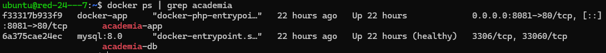
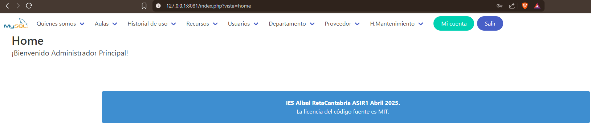
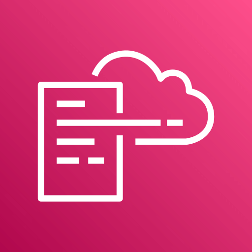
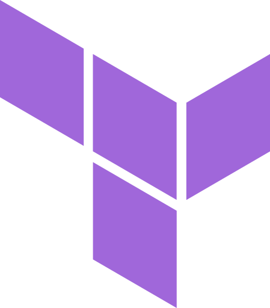
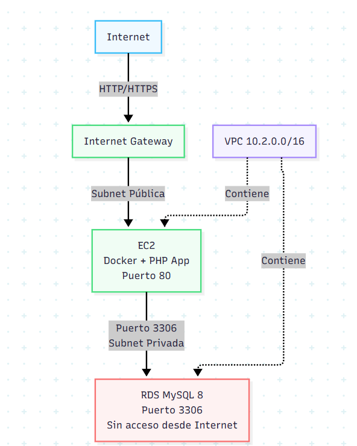
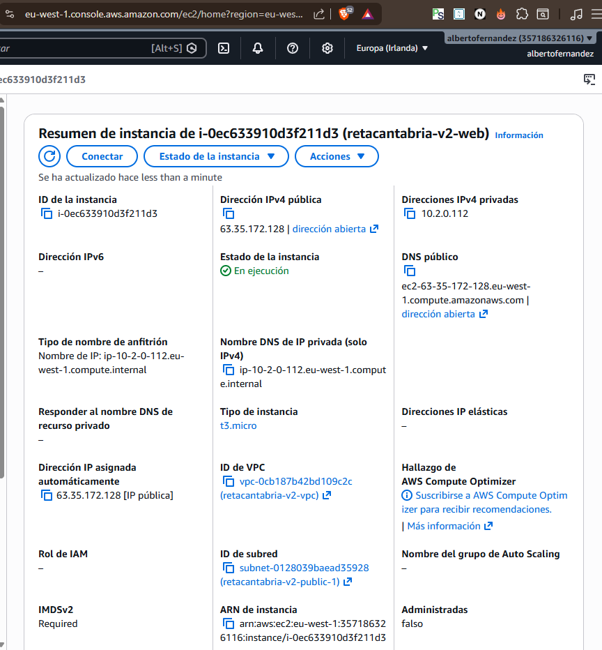
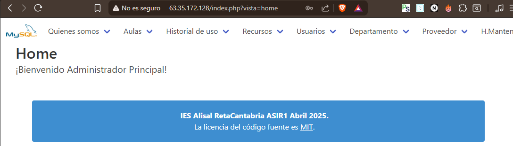
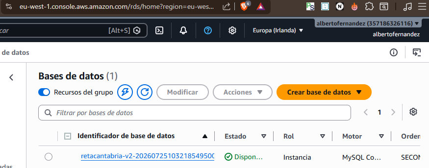

<a id="readme-top"></a>

<div align="center">

# ☁️ AWS Cloud Infrastructure — Academia de Pintura `v2`

### Docker · Terraform · CI/CD con GitHub Actions

Despliegue de una app real de inventario (PHP + MySQL) en AWS, en **cuatro fases**:<br/>
**contenerizar → infraestructura como código → automatizar → documentar**

<br/>

[![Terraform CI][ci-terraform-badge]][ci-terraform-url]
[![Docker Build][ci-docker-badge]][ci-docker-url]

[![AWS][aws-badge]][aws-url]
[![Terraform][terraform-badge]][terraform-url]
[![Docker][docker-badge]][docker-url]
[![GitHub Actions][gha-badge]][gha-url]
[![Ubuntu][ubuntu-badge]][ubuntu-url]
[![MySQL][mysql-badge]][mysql-url]
[![PHP][php-badge]][php-url]

<br/>

[![LinkedIn][linkedin-badge]][linkedin-url]
[![Gmail][gmail-badge]][gmail-url]

</div>

---

## 🧭 Navegación rápida

| [🐳 Fase 1](#-fase-1--app-dockerizada-local) | [🧱 Fase 2](#-fase-2--infraestructura-en-aws-con-terraform) | [🔁 Fase 3](#-fase-3--cicd-con-github-actions) | [📚 Fase 4](#-fase-4--documentación) |
| :---: | :---: | :---: | :---: |
| App dockerizada | IaC con Terraform | CI/CD | Documentación |

<details>
<summary><b>📑 Índice completo</b></summary>
<br/>

- [📖 Introducción](#-introducción)
- [🐳 Fase 1 — App dockerizada (local)](#-fase-1--app-dockerizada-local)
- [🧱 Fase 2 — Infraestructura en AWS con Terraform](#-fase-2--infraestructura-en-aws-con-terraform)
  - [🆚 ¿Por qué Terraform? CloudFormation vs Terraform](#-por-qué-terraform-cloudformation-vs-terraform)
  - [📐 Arquitectura](#-arquitectura)
  - [🧩 Estructura y módulos](#-estructura-y-módulos)
  - [🔐 Variables y despliegue](#-variables-y-despliegue)
  - [💸 Destroy — decisión FinOps](#-destroy--decisión-finops)
- [🔁 Fase 3 — CI/CD con GitHub Actions](#-fase-3--cicd-con-github-actions)
- [📚 Fase 4 — Documentación](#-fase-4--documentación)
  - [🔒 Seguridad](#-seguridad)
  - [📈 Mejoras futuras](#-mejoras-futuras)
- [🤝 Contacto](#-contacto)

</details>

---

## 📖 Introducción

Versión 2 de mi proyecto [aws-cloud-infrastructure-project](https://github.com/albert0fernandez/aws-cloud-infrastructure-project), donde practico las herramientas que estoy aprendiendo. La aplicación (un CRUD de recursos, aulas y usuarios) no cambia; **lo que evoluciona es cómo se construye y opera su infraestructura**:

- **v1** — infraestructura definida con **CloudFormation**.
- **v2** — misma arquitectura con **Terraform**, la app en **Docker** y una capa de **CI/CD**.

El repositorio está organizado por fases:

```
.
├── docker/            # Fase 1 — app dockerizada (Dockerfile, init.sql, docker-compose.yml)
├── terraform/         # Fase 2 — Infraestructura como Código (módulos: network · compute · database)
└── .github/workflows/ # Fase 3 — CI/CD (terraform.yml · docker.yml)
```

<p align="right">(<a href="#readme-top">⬆️ volver arriba</a>)</p>

---

## 🐳 Fase 1 — App dockerizada (local)

Con **Docker Compose** reproduzco en local el mismo par que luego habrá en AWS, en dos contenedores:

- **`app`** — `php:8.3-apache` (extensiones `mysqli`, `pdo_mysql`, `xsl`), sirve en el puerto 80.
- **`db`** — MySQL 8, se inicializa sola con `db/init.sql`.

Dos guiños a producción: la BD **no expone puertos** (aislada, como una RDS privada) y la app **espera al *healthcheck*** de MySQL antes de arrancar.

```bash
cd docker
cp .env.example .env
docker compose up -d --build
```

La app queda en **`http://localhost:8081`** (el compose mapea `8081:80`).

<details>
<summary><b>📸 Ver capturas — contenedores y app en local</b></summary>
<br/>





</details>

<p align="right">(<a href="#readme-top">⬆️ volver arriba</a>)</p>

---

## 🧱 Fase 2 — Infraestructura en AWS con Terraform

Llevo esa arquitectura a AWS **sin clicar en la consola**: la describo en ficheros `.tf` y Terraform la crea (o la destruye) con un comando. Así es repetible, versionable en Git y fácil de eliminar.

### 🆚 ¿Por qué Terraform? CloudFormation vs Terraform

Ambos son *Infraestructura como Código*, pero con diferencias que justifican el salto:

| Aspecto |  CloudFormation |  Terraform |
| :--- | :--- | :--- |
| **Lenguaje** | YAML/JSON, solo AWS | HCL, multi-proveedor |
| **Estado** | Lo gestiona AWS (*stacks*) | Fichero `terraform.tfstate` que gestionas tú |
| **Previsualización** | *Change sets* (paso aparte) | `terraform plan` nativo: ves los cambios antes de aplicar |
| **Reutilización** | *Nested stacks* | **Módulos** de primera clase |

**En resumen:** Terraform aporta un `plan` antes del `apply`, un estado explícito que hay que proteger y una modularidad que hace el código reutilizable.

### 📐 Arquitectura

Una **VPC** de dos capas: la **EC2** vive en subredes **públicas** (sirve la app); la **RDS**, en subredes **privadas** (sin Internet). Solo la EC2 habla con la base de datos, por el puerto 3306. Todo en **2 zonas de disponibilidad**.



El acceso lo controlan los ***security groups***: puerto **80** abierto, **22 (SSH)** solo desde tu IP y **3306** solo desde la capa web.

#### 🧰 Recursos de AWS utilizados

| | Servicio | Categoría | Función |
|:---:|:---|:---|:---|
| 🌐 | **VPC** | Networking | Red aislada con subredes públicas y privadas (2 AZ). |
| 🚪 | **Internet Gateway** | Networking | Salida a Internet para las subredes públicas. |
| 🛡️ | **Security Groups** | Seguridad | Cortafuegos: 80 público, 22 tu IP, 3306 solo web. |
| 🖥️ | **EC2** | Computación | *Hosting* de la app PHP en un contenedor Docker. |
| 🗄️ | **RDS (MySQL 8)** | Base de datos | Base de datos relacional gestionada y privada. |

> Arquitectura **mínima y de coste ~0 € bajo demanda** (Free Tier): sin ELB/ASG, S3 ni Lambda.

### 🧩 Estructura y módulos

El código se divide en **módulos** reutilizables (como funciones):

| Módulo | Qué crea |
| :--- | :--- |
| **`network`** | VPC, subredes públicas/privadas (2 AZ), Internet Gateway, rutas y *security groups*. |
| **`compute`** | EC2 Ubuntu 24.04 (`t3.micro`) + `user_data.sh.tpl`. |
| **`database`** | RDS MySQL 8 (`db.t3.micro`) privada. |

**`user_data.sh.tpl`** es donde **se unen Docker y Terraform**: al arrancar, la EC2 instala Docker, clona el repo, carga `init.sql` y levanta el contenedor apuntando a la RDS (por eso tras el `apply` conviene esperar ~3-4 min).

### 🔐 Variables y despliegue

Dos variables son obligatorias y **nunca se suben al repo**: `admin_cidr` (tu IP en CIDR, para SSH) y `db_password` (contraseña maestra de la RDS). El resto tienen valores por defecto (`aws_region = eu-west-1`, Free Tier…). Crea `terraform.tfvars` a partir de `terraform.tfvars.example`.

```bash
export AWS_PROFILE=admin   # usuario IAM, no root
cd terraform
terraform init
terraform plan
terraform apply            # crea la infraestructura (~5-10 min por la RDS)
```

Al terminar verás los **outputs** (IP pública + endpoint RDS). Login de demostración: **`Administrador`** / **`MiClave@2026`**.

> **🔧 Un reto que resolví:** el login fallaba porque el `init.sql` traía *hashes* de contraseña desconocidos. Lo arreglé fijando una contraseña conocida y **recreando solo la EC2** con `terraform apply -replace="module.compute.aws_instance.web"`, sin tocar la RDS ni la red. Buen ejemplo de por qué el estado y la modularidad de Terraform importan: reconstruyes una pieza sin afectar a las demás.

### 💸 Destroy — decisión FinOps

AWS **cobra por hora**, así que la plataforma se levanta bajo demanda y se destruye al terminar:

```bash
export AWS_PROFILE=admin
cd terraform
terraform destroy
```

Una vez destruida la infraestructura, el **coste es ~0 €**: el código queda en el repo y se vuelve a levantar idéntico en minutos.

```
Código .tf  →  apply  →  Infra en AWS  →  verificar  →  destroy
(describes)    (crea)     (existe/cobra)   (capturas)    (borra todo)
```

<p align="right">(<a href="#readme-top">⬆️ volver arriba</a>)</p>

---

## 🔁 Fase 3 — CI/CD con GitHub Actions

Cada cambio se valida y se empaqueta solo, sin pasos manuales. Los workflows viven en `.github/workflows/`:

| Workflow | Se dispara con… | Qué hace |
|---|---|---|
| [**Terraform CI**][ci-terraform-url] | cambios en `terraform/**` | `fmt` → `init` → `validate`. Valida sintaxis **sin credenciales AWS**. |
| [**Docker Build**][ci-docker-url] | cambios en `docker/**` | construye la imagen y la sube a **GHCR** (`ghcr.io/albert0fernandez/academia-app`) con tags `latest` y SHA corto. |

Docker Build se autentica en GHCR con el `GITHUB_TOKEN` automático de Actions, sin claves propias. El estado se ve en los **badges** de arriba y en la pestaña **Actions**.

<p align="right">(<a href="#readme-top">⬆️ volver arriba</a>)</p>

---

## 📚 Fase 4 — Documentación

**App en AWS** — el inventario funcionando con la IP pública que devuelve Terraform:



<details>
<summary><b>📸 Ver capturas — consola de AWS (<code>eu-west-1</code>): EC2 en <i>running</i> y RDS en <i>available</i></b></summary>
<br/>





</details>

### 🔒 Seguridad

- **Secretos fuera del repo** — `tfvars`, `tfstate`, `.terraform/` y `tfplan` en `.gitignore`.
- **RDS privada** — sin IP pública; solo accesible desde la EC2.
- **SSH restringido** — puerto 22 solo desde tu IP.
- **Usuario IAM en vez de root** — root se reserva para facturación y emergencias.

### 📈 Mejoras futuras

Alta disponibilidad (ALB + Auto Scaling en varias AZ), backend remoto del estado (S3 + DynamoDB), CI con `terraform plan` en cada PR (vía OIDC), secretos en AWS Secrets Manager, RDS Multi-AZ y permisos IAM de mínimo privilegio.

<p align="right">(<a href="#readme-top">⬆️ volver arriba</a>)</p>

---

## 🤝 Contacto

<div align="center">

**Alberto Fernández Baeza** — construyendo mi camino en Cloud & DevOps

[![LinkedIn][linkedin-badge]][linkedin-url]
[![Gmail][gmail-badge]][gmail-url]
[![GitHub][github-badge]][github-url]

<sub>⭐ Si este proyecto te ha resultado útil o interesante, una estrella siempre anima.</sub>

</div>

<!-- ============================ enlaces ============================ -->

[ci-terraform-badge]: https://github.com/albert0fernandez/aws-infraestructure-version-2/actions/workflows/terraform.yml/badge.svg
[ci-terraform-url]: https://github.com/albert0fernandez/aws-infraestructure-version-2/actions/workflows/terraform.yml
[ci-docker-badge]: https://github.com/albert0fernandez/aws-infraestructure-version-2/actions/workflows/docker.yml/badge.svg
[ci-docker-url]: https://github.com/albert0fernandez/aws-infraestructure-version-2/actions/workflows/docker.yml
[aws-badge]: https://img.shields.io/badge/AWS-232F3E?style=for-the-badge&logo=data:image/svg%2Bxml;base64,PHN2ZyBmaWxsPSJ3aGl0ZXNtb2tlIiByb2xlPSJpbWciIHZpZXdCb3g9IjAgMCAyNCAyNCIgeG1sbnM9Imh0dHA6Ly93d3cudzMub3JnLzIwMDAvc3ZnIj48dGl0bGU%2BQW1hem9uIEFXUzwvdGl0bGU%2BPHBhdGggZD0iTTYuNzYzIDEwLjAzNmMwIC4yOTYuMDMyLjUzNS4wODguNzEuMDY0LjE3Ni4xNDQuMzY4LjI1Ni41NzYuMDQuMDYzLjA1Ni4xMjcuMDU2LjE4MyAwIC4wOC0uMDQ4LjE2LS4xNTIuMjRsLS41MDMuMzM1YS4zODMuMzgzIDAgMCAxLS4yMDguMDcyYy0uMDggMC0uMTYtLjA0LS4yMzktLjExMmEyLjQ3IDIuNDcgMCAwIDEtLjI4Ny0uMzc1IDYuMTggNi4xOCAwIDAgMS0uMjQ4LS40NzFjLS42MjIuNzM0LTEuNDA1IDEuMTAxLTIuMzQ3IDEuMTAxLS42NyAwLTEuMjA1LS4xOTEtMS41OTYtLjU3NC0uMzkxLS4zODQtLjU5LS44OTQtLjU5LTEuNTMzIDAtLjY3OC4yMzktMS4yMy43MjYtMS42NDQuNDg3LS40MTUgMS4xMzMtLjYyMyAxLjk1NS0uNjIzLjI3MiAwIC41NTEuMDI0Ljg0Ni4wNjQuMjk2LjA0LjYuMTA0LjkxOC4xNzZ2LS41ODNjMC0uNjA3LS4xMjctMS4wMy0uMzc1LTEuMjc3LS4yNTUtLjI0OC0uNjg2LS4zNjctMS4zLS4zNjctLjI4IDAtLjU2OC4wMzEtLjg2My4xMDMtLjI5NS4wNzItLjU4My4xNi0uODYyLjI3MmEyLjI4NyAyLjI4NyAwIDAgMS0uMjguMTA0LjQ4OC40ODggMCAwIDEtLjEyNy4wMjNjLS4xMTIgMC0uMTY4LS4wOC0uMTY4LS4yNDd2LS4zOTFjMC0uMTI4LjAxNi0uMjI0LjA1Ni0uMjhhLjU5Ny41OTcgMCAwIDEgLjIyNC0uMTY3Yy4yNzktLjE0NC42MTQtLjI2NCAxLjAwNS0uMzZhNC44NCA0Ljg0IDAgMCAxIDEuMjQ2LS4xNTFjLjk1IDAgMS42NDQuMjE2IDIuMDkxLjY0Ny40MzkuNDMuNjYyIDEuMDg1LjY2MiAxLjk2M3YyLjU4NnptLTMuMjQgMS4yMTRjLjI2MyAwIC41MzQtLjA0OC44MjItLjE0NC4yODctLjA5Ni41NDMtLjI3MS43NTgtLjUxLjEyOC0uMTUyLjIyNC0uMzIuMjcyLS41MTIuMDQ3LS4xOTEuMDgtLjQyMy4wOC0uNjk0di0uMzM1YTYuNjYgNi42NiAwIDAgMC0uNzM1LS4xMzYgNi4wMiA2LjAyIDAgMCAwLS43NS0uMDQ4Yy0uNTM1IDAtLjkyNi4xMDQtMS4xOS4zMi0uMjYzLjIxNS0uMzkuNTE4LS4zOS45MTcgMCAuMzc1LjA5NS42NTUuMjk1Ljg0Ni4xOTEuMi40Ny4yOTYuODM4LjI5NnptNi40MS44NjJjLS4xNDQgMC0uMjQtLjAyNC0uMzA0LS4wOC0uMDY0LS4wNDgtLjEyLS4xNi0uMTY4LS4zMTFMNy41ODYgNS41NWExLjM5OCAxLjM5OCAwIDAgMS0uMDcyLS4zMmMwLS4xMjguMDY0LS4yLjE5MS0uMmguNzgzYy4xNTEgMCAuMjU1LjAyNS4zMS4wOC4wNjUuMDQ4LjExMy4xNi4xNi4zMTJsMS4zNDIgNS4yODQgMS4yNDUtNS4yODRjLjA0LS4xNi4wODgtLjI2NC4xNTEtLjMxMmEuNTQ5LjU0OSAwIDAgMSAuMzItLjA4aC42MzhjLjE1MiAwIC4yNTYuMDI1LjMyLjA4LjA2My4wNDguMTIuMTYuMTUxLjMxMmwxLjI2MSA1LjM0OCAxLjM4MS01LjM0OGMuMDQ4LS4xNi4xMDQtLjI2NC4xNi0uMzEyYS41Mi41MiAwIDAgMSAuMzExLS4wOGguNzQzYy4xMjcgMCAuMi4wNjUuMi4yIDAgLjA0LS4wMDkuMDgtLjAxNy4xMjhhMS4xMzcgMS4xMzcgMCAwIDEtLjA1Ni4ybC0xLjkyMyA2LjE3Yy0uMDQ4LjE2LS4xMDQuMjYzLS4xNjguMzExYS41MS41MSAwIDAgMS0uMzAzLjA4aC0uNjg3Yy0uMTUxIDAtLjI1NS0uMDI0LS4zMi0uMDgtLjA2My0uMDU2LS4xMTktLjE2LS4xNS0uMzJsLTEuMjM4LTUuMTQ4LTEuMjMgNS4xNGMtLjA0LjE2LS4wODcuMjY0LS4xNS4zMi0uMDY1LjA1Ni0uMTc3LjA4LS4zMi4wOHptMTAuMjU2LjIxNWMtLjQxNSAwLS44My0uMDQ4LTEuMjI5LS4xNDMtLjM5OS0uMDk2LS43MS0uMi0uOTE4LS4zMi0uMTI4LS4wNzEtLjIxNS0uMTUxLS4yNDctLjIyM2EuNTYzLjU2MyAwIDAgMS0uMDQ4LS4yMjR2LS40MDdjMC0uMTY3LjA2NC0uMjQ3LjE4My0uMjQ3LjA0OCAwIC4wOTYuMDA4LjE0NC4wMjQuMDQ4LjAxNi4xMi4wNDguMi4wOC4yNzEuMTIuNTY2LjIxNS44NzguMjc5LjMxOS4wNjQuNjMuMDk2Ljk1LjA5Ni41MDIgMCAuODk0LS4wODggMS4xNjUtLjI2NGEuODYuODYgMCAwIDAgLjQxNS0uNzU4Ljc3Ny43NzcgMCAwIDAtLjIxNS0uNTU5Yy0uMTQ0LS4xNTEtLjQxNi0uMjg3LS44MDctLjQxNWwtMS4xNTctLjM2Yy0uNTgzLS4xODMtMS4wMTQtLjQ1NC0xLjI3Ny0uODEzYTEuOTAyIDEuOTAyIDAgMCAxLS40LTEuMTU4YzAtLjMzNS4wNzMtLjYzLjIxNi0uODg2LjE0NC0uMjU1LjMzNS0uNDc5LjU3NS0uNjU0LjI0LS4xODQuNTEtLjMyLjgzLS40MTUuMzItLjA5Ni42NTUtLjEzNiAxLjAwNi0uMTM2LjE3NSAwIC4zNTkuMDA4LjUzNS4wMzIuMTgzLjAyNC4zNS4wNTYuNTE4LjA4OC4xNi4wNC4zMTIuMDguNDU1LjEyNy4xNDQuMDQ4LjI1Ni4wOTYuMzM2LjE0NGEuNjkuNjkgMCAwIDEgLjI0LjIuNDMuNDMgMCAwIDEgLjA3MS4yNjN2LjM3NWMwIC4xNjgtLjA2NC4yNTYtLjE4NC4yNTZhLjgzLjgzIDAgMCAxLS4zMDMtLjA5NiAzLjY1MiAzLjY1MiAwIDAgMC0xLjUzMi0uMzExYy0uNDU1IDAtLjgxNS4wNzEtMS4wNjIuMjIzLS4yNDguMTUyLS4zNzUuMzgzLS4zNzUuNzEgMCAuMjI0LjA4LjQxNi4yNC41NjcuMTU5LjE1Mi40NTQuMzA0Ljg3Ny40NGwxLjEzNC4zNThjLjU3NC4xODQuOTkuNDQgMS4yMzcuNzY3LjI0Ny4zMjcuMzY3LjcwMi4zNjcgMS4xMTcgMCAuMzQzLS4wNzIuNjU1LS4yMDcuOTI2LS4xNDQuMjcyLS4zMzYuNTExLS41ODMuNzAzLS4yNDguMi0uNTQzLjM0My0uODg2LjQ0Ny0uMzYuMTExLS43MzQuMTY3LTEuMTQyLjE2N3pNMjEuNjk4IDE2LjIwN2MtMi42MjYgMS45NC02LjQ0MiAyLjk2OS05LjcyMiAyLjk2OS00LjU5OCAwLTguNzQtMS43LTExLjg3LTQuNTI2LS4yNDctLjIyMy0uMDI0LS41MjcuMjcyLS4zNTEgMy4zODQgMS45NjMgNy41NTkgMy4xNTMgMTEuODc3IDMuMTUzIDIuOTE0IDAgNi4xMTQtLjYwNyA5LjA2LTEuODUyLjQzOS0uMi44MTQuMjg3LjM4My42MDd6TTIyLjc5MiAxNC45NjFjLS4zMzYtLjQzLTIuMjItLjIwNy0zLjA3NC0uMTAzLS4yNTUuMDMyLS4yOTUtLjE5Mi0uMDYzLS4zNiAxLjUtMS4wNTMgMy45NjctLjc1IDQuMjU0LS4zOTkuMjg3LjM2LS4wOCAyLjgyNi0xLjQ4NSA0LjAwNy0uMjE1LjE4NC0uNDIzLjA4OC0uMzI3LS4xNTEuMzItLjc5IDEuMDMtMi41Ny42OTUtMi45OTR6Ii8%2BPC9zdmc%2B
[aws-url]: https://aws.amazon.com
[terraform-badge]: https://img.shields.io/badge/Terraform-7B42BC?style=for-the-badge&logo=terraform&logoColor=white
[terraform-url]: https://developer.hashicorp.com/terraform
[docker-badge]: https://img.shields.io/badge/Docker-2496ED?style=for-the-badge&logo=docker&logoColor=white
[docker-url]: https://www.docker.com
[gha-badge]: https://img.shields.io/badge/GitHub%20Actions-2088FF?style=for-the-badge&logo=githubactions&logoColor=white
[gha-url]: https://github.com/features/actions
[ubuntu-badge]: https://img.shields.io/badge/Ubuntu-E95420?style=for-the-badge&logo=ubuntu&logoColor=white
[ubuntu-url]: https://ubuntu.com
[mysql-badge]: https://img.shields.io/badge/MySQL-4479A1?style=for-the-badge&logo=mysql&logoColor=white
[mysql-url]: https://www.mysql.com
[php-badge]: https://img.shields.io/badge/PHP-777BB4?style=for-the-badge&logo=php&logoColor=white
[php-url]: https://www.php.net
[linkedin-badge]: https://img.shields.io/badge/LinkedIn-0A66C2?style=for-the-badge&logo=data:image/svg%2Bxml;base64,PHN2ZyBmaWxsPSJ3aGl0ZXNtb2tlIiByb2xlPSJpbWciIHZpZXdCb3g9IjAgMCAyNCAyNCIgeG1sbnM9Imh0dHA6Ly93d3cudzMub3JnLzIwMDAvc3ZnIj48dGl0bGU%2BTGlua2VkSW48L3RpdGxlPjxwYXRoIGQ9Ik0yMC40NDcgMjAuNDUyaC0zLjU1NHYtNS41NjljMC0xLjMyOC0uMDI3LTMuMDM3LTEuODUyLTMuMDM3LTEuODUzIDAtMi4xMzYgMS40NDUtMi4xMzYgMi45Mzl2NS42NjdIOS4zNTFWOWgzLjQxNHYxLjU2MWguMDQ2Yy40NzctLjkgMS42MzctMS44NSAzLjM3LTEuODUgMy42MDEgMCA0LjI2NyAyLjM3IDQuMjY3IDUuNDU1djYuMjg2ek01LjMzNyA3LjQzM2MtMS4xNDQgMC0yLjA2My0uOTI2LTIuMDYzLTIuMDY1IDAtMS4xMzguOTItMi4wNjMgMi4wNjMtMi4wNjMgMS4xNCAwIDIuMDY0LjkyNSAyLjA2NCAyLjA2MyAwIDEuMTM5LS45MjUgMi4wNjUtMi4wNjQgMi4wNjV6bTEuNzgyIDEzLjAxOUgzLjU1NVY5aDMuNTY0djExLjQ1MnpNMjIuMjI1IDBIMS43NzFDLjc5MiAwIDAgLjc3NCAwIDEuNzI5djIwLjU0MkMwIDIzLjIyNy43OTIgMjQgMS43NzEgMjRoMjAuNDUxQzIzLjIgMjQgMjQgMjMuMjI3IDI0IDIyLjI3MVYxLjcyOUMyNCAuNzc0IDIzLjIgMCAyMi4yMjIgMGguMDAzeiIvPjwvc3ZnPg%3D%3D
[linkedin-url]: https://www.linkedin.com/in/albertofernandezbaeza
[gmail-badge]: https://img.shields.io/badge/Gmail-EA4335?style=for-the-badge&logo=gmail&logoColor=white
[gmail-url]: mailto:albertofernandezbaeza@gmail.com
[github-badge]: https://img.shields.io/badge/GitHub-181717?style=for-the-badge&logo=github&logoColor=white
[github-url]: https://github.com/albert0fernandez
